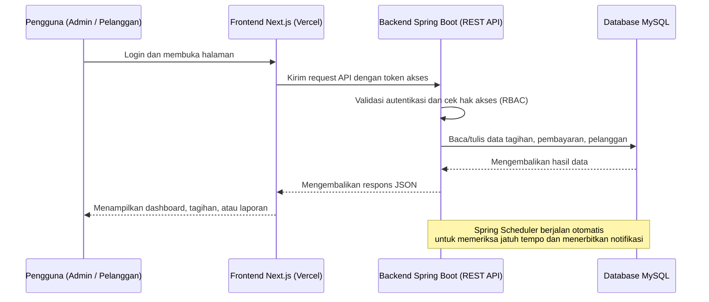
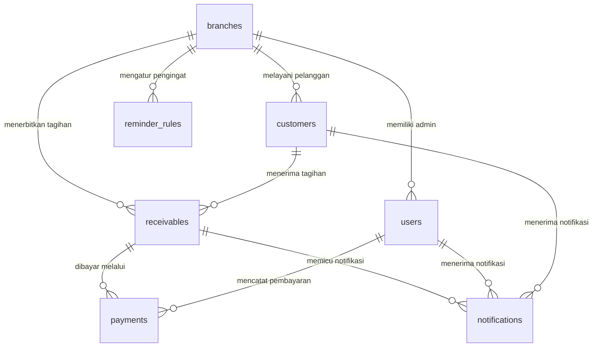

# PRD — Project Requirements Document

## 1. Overview

**Nusa Karsa Event** masih mengelola piutang secara manual, sehingga sering menghadapi masalah seperti kesalahan pencatatan, lambatnya rekonsiliasi pembayaran, sulitnya memantau tagihan jatuh tempo, dan lambatnya penyusunan laporan manajemen.

PRD ini mendefinisikan **Sistem Informasi Digitalisasi Pencatatan dan Monitoring Piutang Pelanggan** yang akan menjadi satu pusat data bagi seluruh aktivitas piutang usaha:

- Seluruh tagihan, pembayaran, dan data pelanggan tersimpan terpusat.
- Admin pusat dan admin cabang dapat bekerja sesuai wilayah kewenangannya.
- Pelanggan dapat login dan melihat tagihan yang memang diizinkan untuk dilihat.
- Setiap tagihan yang mendekati jatuh tempo mendapat peringatan otomatis.
- Laporan piutang dapat disajikan cepat, akurat, dan mudah dipahami manajemen.

## 2. Requirements

**Kebutuhan Fungsional Utama:**

- Aplikasi memiliki **3 jalur akses**: Admin Pusat, Admin Cabang, dan Pelanggan.
- Setiap pengguna hanya dapat mengakses data sesuai peran dan cabangnya masing-masing.
- Admin Pusat dapat melihat dan mengelola seluruh cabang.
- Admin Cabang hanya dapat mengelola tagihan, pembayaran, dan pelanggan pada cabangnya sendiri.
- Pelanggan dapat login menggunakan **email dan password**, lalu melihat daftar tagihan miliknya yang berstatus **publik**.
- Tagihan yang berstatus **privat** tidak boleh terlihat oleh pelanggan, hanya oleh admin terkait.
- Pembayaran dicatat oleh admin, dan secara otomatis mengurangi sisa tagihan.
- Sistem menyediakan riwayat pembayaran dan detail transaksi.
- Sistem menyediakan laporan rekap piutang, baik per status, per periode, maupun per cabang.
- Sistem memberikan notifikasi otomatis untuk tagihan yang mendekati atau melewati jatuh tempo.

**Kebutuhan Non-Fungsional:**

- Data harus aman: password disimpan dalam bentuk terenkripsi/hash.
- Hak akses diterapkan pada setiap fitur melalui kontrol peran (RBAC).
- Sistem mudah digunakan oleh admin dan pelanggan non-teknis.
- Kelola data dalam jumlah besar tetap terasa cepat melalui pencarian dan filter.
- Sistem dapat terus dikembangkan bertahap sesuai kebutuhan bisnis.

## 3. Core Features

### Fase 1 — Monitoring Tagihan

- **Daftar Tagihan**  
  Halaman utama untuk memantau seluruh tagihan piutang dalam satu layar.
  - **Ringkasan Piutang** — Menampilkan total piutang, jumlah yang sudah tertagih, dan sisa tagihan yang belum dibayar.
  - **Daftar Semua Tagihan** — Menampilkan seluruh tagihan beserta status, jatuh tempo, dan sisa pembayaran.
  - **Cari & Filter Tagihan** — Mencari tagihan berdasarkan pelanggan, status, atau cabang dengan cepat.
  - **Detail Tagihan** — Membuka rincian lengkap tagihan beserta riwayat pembayarannya.

### Fase 2 — Kelola Tagihan & Pembayaran

- **Kelola Tagihan**  
  - **Tambah Tagihan** — Membuat tagihan baru dengan memilih pelanggan, nominal, dan tanggal jatuh tempo.
  - **Ubah Tagihan** — Memperbarui informasi tagihan jika ada koreksi data.
  - **Hapus Tagihan** — Menghapus tagihan yang salah atau tidak berlaku agar data tetap bersih.

- **Pembayaran**  
  - **Catat Pembayaran** — Menginput pembayaran masuk; sistem otomatis mengurangi sisa tagihan.
  - **Riwayat Pembayaran** — Menampilkan semua pembayaran yang tercatat lengkap dengan tanggal dan metode.
  - **Detail Pembayaran** — Melihat informasi lengkap dari satu transaksi pembayaran.

### Fase 3 — Kelola Pelanggan & Laporan Piutang

- **Kelola Pelanggan**  
  - **Tambah Pelanggan** — Menyimpan data pelanggan baru seperti nama, kontak, dan cabang.
  - **Ubah Pelanggan** — Memperbarui informasi pelanggan bila ada perubahan data.
  - **Cari Pelanggan** — Menemukan pelanggan dengan cepat untuk proses tagihan atau pembayaran.
  - **Aktif & Nonaktifkan Pelanggan** — Mengatur status aktif pelanggan untuk mengontrol akses login.

- **Laporan Piutang**  
  - **Rekap Status Piutang** — Melihat ringkasan piutang per status, misalnya belum bayar, lunas, atau jatuh tempo.
  - **Rekap per Cabang** — Membandingkan piutang antar cabang.
  - **Filter Periode** — Menyaring laporan berdasarkan tanggal atau periode tertentu.
  - **Unduh Laporan** — Mengekspor laporan piutang menjadi file untuk dibagikan.

### Fase 4 — Kontrol Akses, Privasi Tagihan, dan Login Pengguna

- **Privasi Tagihan**  
  - **Tandai Tagihan Publik** — Membuat tagihan terlihat oleh pelanggan yang bersangkutan.
  - **Tandai Tagihan Privat** — Menyembunyikan tagihan dari pelanggan agar hanya admin yang bisa melihat.
  - **Ubah Visibilitas Sekaligus** — Mengubah status publik/privat banyak tagihan sekaligus.

- **Login & Peran Pengguna**  
  - **Masuk Admin** — Admin pusat dan admin cabang masuk dengan akun sesuai perannya.
  - **Masuk Pelanggan** — Pelanggan masuk dengan email dan kata sandi untuk melihat tagihan miliknya.
  - **Kelola Akun & Peran** — Mengatur pengguna, jabatan, dan hak akses dalam aplikasi.
  - **Keluar Akun** — Mengakhiri sesi masuk dengan aman.

### Fase 5 — Pengingat Jatuh Tempo

- **Notifikasi Tagihan** — Menerima pemberitahuan otomatis untuk tagihan yang segera jatuh tempo.
- **Daftar Tagihan Tertunggak** — Melihat semua tagihan yang sudah lewat jatuh tempo.
- **Atur Pengingat** — Menentukan waktu pemberitahuan sebelum jatuh tempo.

## 4. User Flow

### Alur Admin Pusat

1. Admin membuka halaman login dan memilih **Masuk Admin**.
2. Sistem memvalidasi username serta password, lalu menentukan peran sebagai **Admin Pusat**.
3. Admin masuk ke dashboard dan melihat ringkasan piutang dari semua cabang.
4. Admin dapat membuat tagihan baru, mencatat pembayaran, atau memperbaiki tagihan yang sudah ada.
5. Admin mengatur apakah suatu tagihan **publik** atau **privat**.
6. Admin membuka halaman laporan, memilih periode/cabang, lalu mengunduh laporan.
7. Saat tagihan mendekati jatuh tempo, sistem menampilkan notifikasi di dashboard.

### Alur Admin Cabang

1. Admin cabang login menggunakan akun **Masuk Admin**.
2. Sistem hanya menampilkan data cabang tempat admin tersebut bekerja.
3. Admin membuat tagihan untuk pelanggan di cabangnya.
4. Saat pelanggan membayar, admin mencatat pembayaran dan sistem otomatis mengurangi sisa tagihan.
5. Admin dapat melihat laporan piutang khusus cabangnya saja.

### Alur Pelanggan

1. Admin membuat akun pelanggan dengan email dan password, serta memastikan status pelanggan **aktif**.
2. Pelanggan membuka halaman login dan memilih **Masuk Pelanggan**.
3. Pelanggan melihat daftar tagihan miliknya yang berstatus **publik**.
4. Pelanggan membuka detail satu tagihan untuk melihat total, jatuh tempo, sisa tagihan, dan riwayat pembayaran.
5. Jika ingin membayar, pelanggan menghubungi admin/event organizer. Pembayaran kemudian dicatatkan oleh admin.

## 5. Architecture

Sistem dibangun dengan arsitektur **frontend terpisah dari backend API**:

- **Frontend** menangani tampilan dan interaksi pengguna.
- **Backend** menyediakan REST API untuk seluruh proses bisnis.
- **Database** menyimpan data master dan transaksi.
- Setiap request dari frontend akan dicek dulu autentikasi dan otorisasinya sebelum membaca atau mengubah data.
- Sistem memiliki penjadwal otomatis untuk memeriksa tagihan yang mendekati jatuh tempo dan mengirim notifikasi.

### Komponen Utama

1. **Frontend (Next.js)**  
   Menyediakan halaman login, dashboard, tagihan, pembayaran, pelanggan, laporan, dan pengaturan.

2. **Backend API (Spring Boot)**  
   Menangani aturan bisnis, validasi data, perhitungan piutang, kontrol peran, dan laporan.

3. **Database (MySQL)**  
   Menyimpan semua data master dan transaksi secara terpusat.

Prinsip penting: **setiap admin cabang hanya melihat data cabangnya**, sedangkan admin pusat dapat melihat semua data. Pelanggan hanya melihat tagihan miliknya sendiri yang ditandai publik.

## 6. Database Schema

Berikut tabel-tabel utama yang dibutuhkan. Semua ID adalah primary key dan menggunakan auto-increment.

### `branches`
Tabel untuk menyimpan data cabang Nusa Karsa Event.

| Kolom | Tipe | Kegunaan |
|---|---|---|
| `id` | BIGINT | Primary key |
| `name` | VARCHAR(100) | Nama cabang |
| `address` | TEXT | Alamat cabang |
| `phone` | VARCHAR(20) | Nomor telepon cabang |

### `users`
Tabel untuk akun admin pusat dan admin cabang. Pelanggan tidak disimpan di sini.

| Kolom | Tipe | Kegunaan |
|---|---|---|
| `id` | BIGINT | Primary key |
| `username` | VARCHAR(100) | Username untuk login admin, harus unik |
| `password_hash` | VARCHAR(255) | Password yang sudah di-hash |
| `role` | VARCHAR(30) | Peran: `ADMIN_PUSAT` atau `ADMIN_CABANG` |
| `full_name` | VARCHAR(150) | Nama lengkap admin |
| `branch_id` | BIGINT | Foreign key ke `branches`; wajib untuk admin cabang, kosong untuk admin pusat |
| `is_active` | BOOLEAN | Status akun aktif atau nonaktif |

### `customers`
Tabel untuk data pelanggan sekaligus akun login pelanggan.

| Kolom | Tipe | Kegunaan |
|---|---|---|
| `id` | BIGINT | Primary key |
| `name` | VARCHAR(150) | Nama pelanggan |
| `email` | VARCHAR(150) | Email untuk login pelanggan, harus unik |
| `password_hash` | VARCHAR(255) | Password pelanggan yang sudah di-hash |
| `phone` | VARCHAR(20) | Nomor telepon pelanggan |
| `address` | TEXT | Alamat pelanggan |
| `branch_id` | BIGINT | Foreign key ke `branches`, menunjukkan cabang yang melayani pelanggan |
| `is_active` | BOOLEAN | Jika nonaktif, pelanggan tidak bisa login |

### `receivables`
Tabel untuk menyimpan tagihan piutang.

| Kolom | Tipe | Kegunaan |
|---|---|---|
| `id` | BIGINT | Primary key |
| `customer_id` | BIGINT | Foreign key ke `customers` |
| `branch_id` | BIGINT | Foreign key ke `branches` |
| `description` | VARCHAR(255) | Uraian tagihan, misalnya nama event |
| `total_amount` | DECIMAL(15,2) | Total nilai tagihan |
| `paid_amount` | DECIMAL(15,2) | Jumlah yang sudah dibayar |
| `remaining_amount` | DECIMAL(15,2) | Sisa tagihan yang belum dibayar |
| `status` | VARCHAR(20) | Status: belum bayar, sebagian, lunas, atau tertunggak |
| `due_date` | DATE | Tanggal jatuh tempo tagihan |
| `is_public` | BOOLEAN | Jika `true`, tagihan bisa dilihat pelanggan; jika `false`, hanya admin yang bisa melihat |
| `created_at` | DATETIME | Waktu tagihan dibuat |

### `payments`
Tabel untuk mencatat setiap pembayaran masuk.

| Kolom | Tipe | Kegunaan |
|---|---|---|
| `id` | BIGINT | Primary key |
| `receivable_id` | BIGINT | Foreign key ke `receivables` |
| `user_id` | BIGINT | Foreign key ke `users`, admin yang mencatat pembayaran |
| `amount` | DECIMAL(15,2) | Jumlah pembayaran |
| `payment_date` | DATETIME | Tanggal dan waktu pembayaran |
| `method` | VARCHAR(50) | Metode pembayaran, misalnya tunai atau transfer |
| `notes` | TEXT | Catatan tambahan pembayaran |
| `created_at` | DATETIME | Waktu data dibuat |

### `notifications`
Tabel untuk menyimpan notifikasi jatuh tempo yang muncul di dashboard.

| Kolom | Tipe | Kegunaan |
|---|---|---|
| `id` | BIGINT | Primary key |
| `receivable_id` | BIGINT | Foreign key ke `receivables` sebagai sumber notifikasi |
| `user_id` | BIGINT | Foreign key ke `users`, jika penerima adalah admin |
| `customer_id` | BIGINT | Foreign key ke `customers`, jika penerima adalah pelanggan |
| `title` | VARCHAR(150) | Judul notifikasi |
| `message` | TEXT | Isi notifikasi |
| `is_read` | BOOLEAN | Status sudah dibaca atau belum |
| `created_at` | DATETIME | Waktu notifikasi dibuat |

### `reminder_rules`
Tabel untuk mengatur berapa hari sebelum jatuh tempo notifikasi mulai dikirim.

| Kolom | Tipe | Kegunaan |
|---|---|---|
| `id` | BIGINT | Primary key |
| `branch_id` | BIGINT | Foreign key ke `branches`; jika kosong berlaku untuk semua cabang |
| `days_before` | INT | Jumlah hari sebelum jatuh tempo, misalnya 3 atau 7 hari |
| `is_active` | BOOLEAN | Apakah aturan pengingat aktif |

## 7. Tech Stack

- **Frontend:** Next.js dengan TypeScript  
  Digunakan untuk membangun halaman web aplikasi. Frontend ini dapat di-deploy ke **Vercel**.

- **UI / Styling:** Tailwind CSS dan shadcn/ui  
  Disarankan agar antarmuka cepat dikembangkan dan konsisten serta mudah dipahami pengguna.

- **Backend:** Spring Boot (Java)  
  Menyediakan REST API untuk menangani autentikasi, manajemen tagihan, pembayaran, pelanggan, laporan, dan notifikasi.

- **Autentikasi & Otorisasi:** Spring Security dengan RBAC  
  Sistem memakai token akses yang aman untuk komunikasi antara frontend dan backend.

- **Database:** MySQL  
  Digunakan sebagai penyimpanan data utama dengan skema tabel yang telah dirancang di atas.

- **Penjadwalan Notifikasi:** Spring Scheduler  
  Berjalan di backend untuk memeriksa tagihan yang mendekati jatuh tempo dan membuat notifikasi otomatis.

- **Deployment:**  
  - Frontend Next.js di-deploy ke **Vercel**.  
  - Backend Spring Boot perlu di-deploy di layanan yang mendukung Java (misalnya VPS, Railway, Render, atau AWS), karena Vercel tidak menjalankan backend Java/Spring Boot secara langsung. Frontend dan backend dihubungkan melalui URL API.